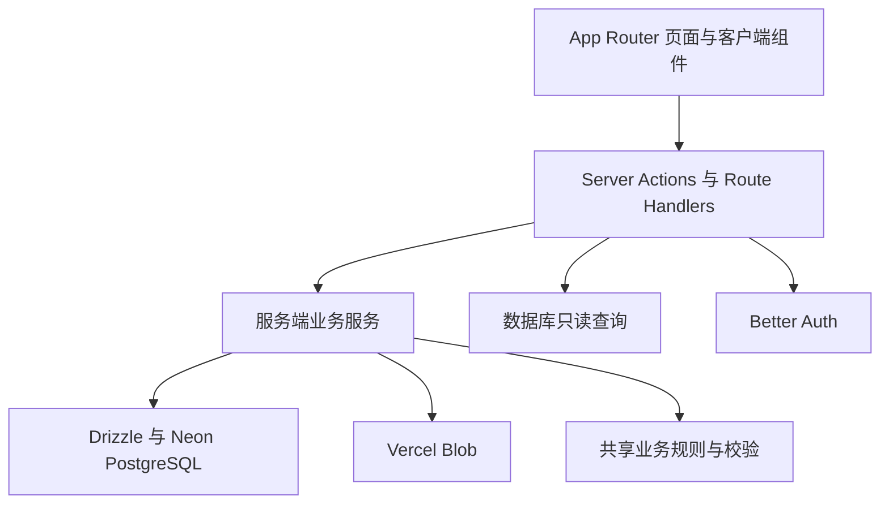

# zihAI

zihAI 是一个面向独立 AI 产品的人工审核发布平台。开发者通过 `qq.com` 或 `163.com` 邮箱验证码、GitHub 或 Google 完成身份验证，设置用户名和密码后即可提交产品截图和持续更新日志；项目与迭代内容只有通过管理员审核后才会公开展示。

> 当前迭代功能暂时关闭。相关数据模型和实现仍然保留，但用户端、公开页和管理端入口均不可访问；恢复时只需调整 `src/lib/features.ts` 中的集中功能开关。

## 核心能力

- 使用 Better Auth 接入 Resend 邮箱验证码（身份邮箱仅支持 `qq.com` 和 `163.com`）、GitHub 和 Google OAuth，并支持用户名密码登录；发送邮件前必须完成一次性图片验证码
- 强制完成用户名、密码、头像和私密联系邮箱设置后才能创建内容或点赞；OAuth 头像不可用时使用站点默认头像
- 支持项目草稿、提交审核、驳回反馈、重新提交与删除
- 每个项目和迭代支持 1～3 张有序截图
- 只允许点赞已审核项目，数据库保证同一用户不能重复点赞
- 提供公开产品页、开发者主页、Open Graph、Robots 和动态 Sitemap
- 首页支持按最新或热度排序、标题/描述关键词搜索、无限滚动分页和一键刷新
- 提供项目/迭代审核、用户角色、封禁和审计日志后台
- 使用 Neon PostgreSQL、Drizzle ORM 与版本化 SQL 迁移
- 使用带签名、短时效上传意图的 Vercel Blob 浏览器直传
- 覆盖公开页、工作台、设置页和管理后台的响应式界面
- 提供完整的简体中文和英文界面，并在站点顶部即时切换语言

## 技术栈

- Next.js 16.3 App Router、React 19、TypeScript 严格模式
- Tailwind CSS 4
- Better Auth 1.6
- Neon PostgreSQL、Drizzle ORM
- Vercel Blob
- Zod 4
- Vitest、ESLint、Prettier、GitHub Actions

## 架构



代码遵循从界面到基础设施的单向依赖：

| 目录             | 职责                                                 |
| ---------------- | ---------------------------------------------------- |
| `src/app`        | 路由、布局、元数据和服务端页面组合                   |
| `src/components` | 可复用服务端/客户端 UI 组件                          |
| `src/actions`    | 身份校验、输入解析、业务编排、缓存失效与重定向       |
| `src/server`     | 跨数据库与外部服务的工作流，例如 Blob 上传和图片排序 |
| `src/db/queries` | 公开页、工作台和管理后台的命名只读模型               |
| `src/db/schema`  | Drizzle 数据库结构与推导类型                         |
| `src/lib`        | 校验、内容生命周期、会话、上传规则和纯工具函数       |

详细边界、审核状态机、上传协议和一致性策略见 [架构说明](docs/ARCHITECTURE.md)。

## 关键业务规则

- 新账号只能在 `qq.com` 或 `163.com` 邮箱验证码、GitHub 或 Google 完成身份验证后创建；私密联系邮箱不受该身份邮箱后缀限制。
- 未完成引导流程的用户不能创建项目、迭代或点赞。
- 一个项目至少填写网站地址或 GitHub 仓库地址之一，也可以同时填写两者。
- 项目和迭代在提交及审核时必须拥有 1～3 张 JPEG、PNG 或 WebP 图片。
- 草稿、待审核、已驳回和已归档内容不会出现在公开查询中。
- 修改已公开字段会清除原审批状态并重新进入审核。
- 待审核的迭代不会导致已通过的父项目下线。
- 同一用户最多点赞同一已通过项目一次。
- 系统必须始终保留至少一名管理员。
- 所有用户创作的公开字段都必须先经过审核。

上述规则不仅存在于界面层：鉴权、所有权和状态转换会在服务端重新检查；URL 异或、唯一点赞、所有者关系和并发图片上限由 PostgreSQL 最终兜底。

## 环境要求

- Node.js 22.13 或更高版本，推荐 Node.js 24
- pnpm 11.16
- Neon PostgreSQL 数据库
- 公开访问的 Vercel Blob Store
- GitHub 和 Google OAuth 应用
- 已验证 `aioff.dev` 的 Resend 账号与 API Key

## 本地开发

1. 安装依赖：

   ```bash
   pnpm install
   ```

2. 创建本地环境文件：

   ```bash
   cp .env.example .env.local
   ```

3. 填写 `.env.local` 中的全部必需变量。认证密钥可用以下命令生成：

   ```bash
   openssl rand -base64 32
   ```

4. 在 OAuth 服务商后台注册本地回调地址：

   ```text
   http://localhost:3000/api/auth/callback/github
   http://localhost:3000/api/auth/callback/google
   ```

5. 执行迁移并启动开发服务器：

   ```bash
   make db-migrate-development
   make dev
   ```

6. 打开 [http://localhost:3000](http://localhost:3000)。

## 中英文切换

站点支持英文（`en`）和简体中文（`zh-CN`）。首次访问时会根据浏览器的 `Accept-Language` 自动选择语言；用户点击顶部语言切换按钮后，选择会保存在有效期一年的 `zihai_locale` HttpOnly Cookie 中，并在公开页、登录流程、工作台、设置页和管理后台保持一致。

语言切换不会修改页面 URL，因此现有公开链接、OAuth 回调地址和 Vercel 路由配置都无需调整。翻译词典和语言解析规则位于 `src/lib/i18n.ts`，服务端语言读取位于 `src/lib/i18n-server.ts`。

## 环境变量

| 变量                    | 用途                                             |
| ----------------------- | ------------------------------------------------ |
| `DATABASE_URL`          | Neon PostgreSQL 池化连接地址                     |
| `BETTER_AUTH_SECRET`    | 至少 32 个字符的私有认证签名密钥                 |
| `BETTER_AUTH_URL`       | 认证服务规范源地址，例如 `http://localhost:3000` |
| `GITHUB_CLIENT_ID`      | GitHub OAuth Client ID                           |
| `GITHUB_CLIENT_SECRET`  | GitHub OAuth Client Secret                       |
| `GOOGLE_CLIENT_ID`      | Google OAuth Client ID                           |
| `GOOGLE_CLIENT_SECRET`  | Google OAuth Client Secret                       |
| `RESEND_API_KEY`        | Resend API Key，在发送认证邮件时校验             |
| `AUTH_EMAIL_FROM`       | 可选；默认 `zihAI <auth@aioff.dev>`              |
| `BLOB_READ_WRITE_TOKEN` | 公开 Vercel Blob Store 的读写令牌                |
| `NEXT_PUBLIC_SITE_URL`  | 不带末尾斜杠的站点公开规范地址                   |

只有 `NEXT_PUBLIC_SITE_URL` 可以暴露给浏览器。数据库、认证、OAuth、Resend 和 Blob 密钥都不能使用 `NEXT_PUBLIC_` 前缀。

Resend 配置采用按需初始化：缺少邮件配置不会阻止公开页面或 OAuth/用户名密码认证读取会话，但发送邮箱验证码前仍会严格校验 `RESEND_API_KEY`。本地开发和部署环境需要提供真实的 `re_` 开头 API Key；未设置 `AUTH_EMAIL_FROM` 时使用已验证的 `aioff.dev` 发件人默认值。

## 创建首位管理员

系统不会自动将第一个注册用户提升为管理员：

1. 使用 `qq.com` 或 `163.com` 邮箱验证码、GitHub 或 Google 登录。
2. 完成用户名、密码、头像和联系邮箱设置；验证邮箱和 Google 默认使用身份邮箱，GitHub 未返回邮箱时需要手动填写。
3. 对目标环境运行：

   ```bash
   pnpm admin:promote admin@example.com
   ```

脚本只会提升已经存在的账号。后续角色调整在 `/admin/users` 完成；应用会通过数据库事务锁阻止撤销或删除最后一名管理员。

## 常用命令

根目录 `Makefile` 统一封装本地开发、质量门禁和三套环境的运维命令。先运行：

```bash
make help
```

Vercel 的 Sensitive 环境变量不能通过 `vercel env pull` 或 `vercel env run` 导出为本地数据库命令使用。因此数据库运维命令必须读取明确且被 Git 忽略的本地环境文件：Development 使用 `.env.local`，Preview 使用 `.env.preview`，Production 使用 `.env.production`。不要用 Vercel CLI 输出替代其中的数据库密钥。Preview 和 Production 文件还必须分别包含 `DATABASE_ENVIRONMENT=preview` 与 `DATABASE_ENVIRONMENT=production`；缺少或错配时命令会在访问数据库前停止。

Vercel CLI 仍用于项目关联和部署管理。安装并确认版本后，首次使用需要关联项目：

```bash
pnpm add -g vercel@59.1.3
make vercel-version
make vercel-link
```

| Make 命令                                                                      | 用途                                             |
| ------------------------------------------------------------------------------ | ------------------------------------------------ |
| `make dev`                                                                     | 启动本地开发服务器                               |
| `make check`                                                                   | 运行完整质量门禁                                 |
| `make vercel-version`                                                          | 显示当前全局 Vercel CLI 版本                     |
| `make db-generate`                                                             | 使用 `.env.local` 生成迁移                       |
| `make db-check-development`                                                    | 检查 Development 迁移                            |
| `make db-migrate-development`                                                  | 检查并迁移 Development 数据库                    |
| `make db-studio-development`                                                   | 打开 Development Drizzle Studio                  |
| `make db-seed-development`                                                     | 创建开发模拟用户、已发布项目及 Blob 封面         |
| `make db-check-preview`                                                        | 使用 `.env.preview` 检查 Preview 迁移            |
| `make db-migrate-preview`                                                      | 使用 `.env.preview` 检查并迁移 Preview 数据库    |
| `make db-check-production`                                                     | 使用 `.env.production` 只读检查 Production 迁移  |
| `make db-migrate-production CONFIRM_PRODUCTION=yes`                            | 使用 `.env.production` 显式确认后迁移 Production |
| `make admin-promote-development EMAIL=admin@example.com`                       | 提升 Development 中的已有用户                    |
| `make admin-promote-preview EMAIL=admin@example.com`                           | 提升 Preview 中的已有用户                        |
| `make admin-promote-production EMAIL=admin@example.com CONFIRM_PRODUCTION=yes` | 显式确认后提升 Production 用户                   |

Development、Preview 和 Production 默认分别读取 `.env.local`、`.env.preview` 和 `.env.production`，可通过 `DEV_ENV_FILE`、`PREVIEW_ENV_FILE` 和 `PRODUCTION_ENV_FILE` 覆盖。命令会清除当前 shell 继承的数据库和站点变量，并校验 Preview 必须对应 `staging.zihai.dev`、Production 必须对应 `www.zihai.dev`。Production 数据迁移和管理员提升仍要求传入 `CONFIRM_PRODUCTION=yes`，避免误操作。

底层 pnpm 命令仍可直接使用：

| 命令                        | 用途                                         |
| --------------------------- | -------------------------------------------- |
| `pnpm dev`                  | 启动 Next.js 开发服务器                      |
| `pnpm build`                | 创建生产构建                                 |
| `pnpm start`                | 启动已生成的生产构建                         |
| `pnpm format`               | 使用 Prettier 格式化支持的文件               |
| `pnpm format:check`         | 检查格式但不修改文件                         |
| `pnpm lint`                 | 运行 ESLint                                  |
| `pnpm typecheck`            | 生成路由类型并运行 TypeScript 检查           |
| `pnpm test`                 | 单次运行 Vitest 测试                         |
| `pnpm test:watch`           | 以监听模式运行 Vitest                        |
| `pnpm check`                | 依次执行格式、Lint、类型、测试和生产构建     |
| `pnpm db:generate`          | 根据 Drizzle Schema 生成新迁移               |
| `pnpm db:check`             | 校验迁移元数据                               |
| `pnpm db:migrate`           | 应用尚未执行的迁移                           |
| `pnpm db:studio`            | 启动 Drizzle Studio                          |
| `pnpm db:seed`              | 创建开发模拟数据（需显式确认并使用本地 URL） |
| `pnpm admin:promote <邮箱>` | 将已有账号提升为管理员                       |

提交代码前必须运行：

```bash
pnpm format
pnpm check
```

`pnpm check` 的生产构建不会初始化数据库或认证服务，因此不需要真实凭据；启动后的服务端请求会在首次使用数据库或认证时严格校验全部必需变量。本地功能验证和 Vercel Preview/Production 运行环境必须配置真实且隔离的变量，构建成功不代表运行时配置完整。

## 数据库变更

数据库结构以 `src/db/schema` 为唯一源头。修改 Schema 后按顺序执行：

```bash
make db-generate
make db-check-development
make db-migrate-development
```

执行迁移前必须人工检查生成的 SQL。不要编辑已经进入共享环境或生产环境的迁移，也不要在应用启动时自动修改生产数据库。初始迁移除表结构外，还包含 URL 异或约束、图片策略、所有者校验和并发图片数量触发器。

## 上传与一致性

浏览器不会直接获得 Blob 密钥。上传流程会签发与用户、资源、路径、MIME 类型和过期时间绑定的上传意图；Blob 写入成功后，浏览器必须等待认证完成接口再次验证签名意图与 Blob 元数据并写入 PostgreSQL，之后界面才提示成功并刷新。Vercel 的完成回调复用同一套幂等服务作为兜底，本地开发不依赖公网回调地址。

- 头像：最多 1 张，单张不超过 2 MiB。
- 项目与迭代：每项最多 3 张，单张不超过 5 MiB。
- 支持格式：JPEG、PNG、WebP。
- 新文件写入数据库失败时，会补偿删除刚上传的 Blob。
- 头像替换在数据库提交后再尽力清理旧 Blob，避免删除已经被引用的新文件。

PostgreSQL 与 Blob 无法共享事务，新增文件工作流时必须明确写出数据库提交与对象清理顺序。

## 测试与质量门禁

当前单元测试覆盖内容生命周期、提交图片数量、输入规范化、安全返回地址、Slug、图片上传策略、公开项目筛选参数、游标分页和预期错误映射。GitHub Actions 在 Pull Request 及推送到 `main` 时执行与本地一致的格式、Lint、类型、测试和构建检查。

涉及认证、Blob 回调、数据库并发约束或缓存的变更，还需要在配置完整的预览环境进行人工冒烟测试。下一阶段的测试与上线任务见 [后续行动计划](specs/NEXT_STEPS.md)。

## 部署

推荐部署组合为 Vercel、Neon PostgreSQL 和 Vercel Blob。生产环境发布前请阅读 [部署说明](docs/DEPLOYMENT.md)，其中包含环境隔离、OAuth 回调、迁移顺序、首位管理员、冒烟测试和回滚边界。

## 安全

- Proxy 只用于改善导航体验，不是授权边界。
- 页面、Server Actions 和 Blob 回调都会重新验证会话、角色和资源所有权。
- 服务端使用 Zod 校验所有公开请求边界，不信任客户端传入的角色、所有者或审核状态。
- Markdown 渲染不启用原始 HTML。
- 管理员审核、角色和封禁操作会写入审计日志。
- 上传意图使用 HMAC 签名，默认十分钟后过期。
- 意外的数据库、OAuth、认证或 Blob 错误不会原样返回浏览器。

安全问题请私下联系仓库维护者，不要创建包含密钥、个人数据或可运行攻击代码的公开 Issue。详情见 [安全策略](SECURITY.md)。
