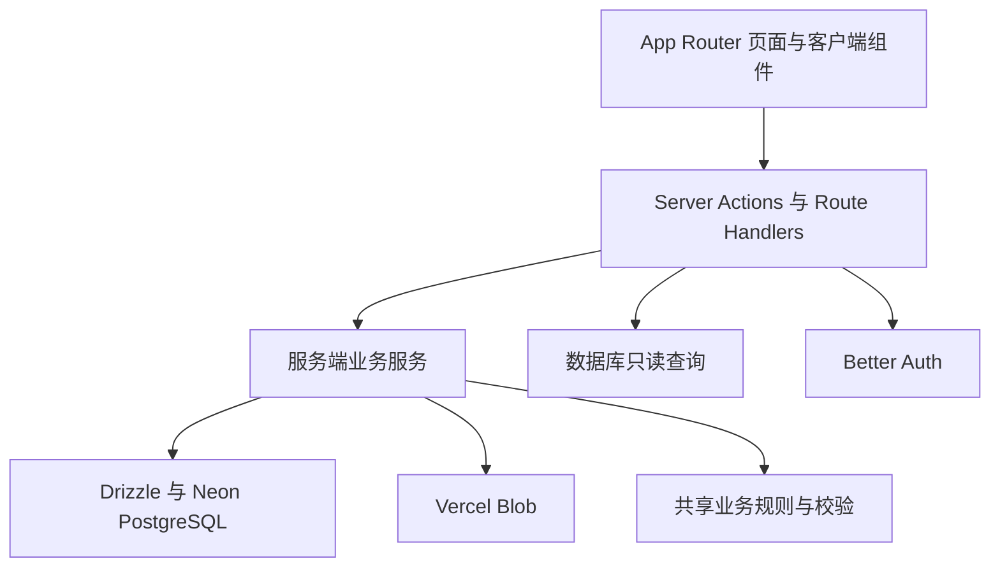

# zihAI

zihAI 是一个面向独立 AI 产品的人工审核发布平台。开发者通过 GitHub 或 Google 登录，完成个人资料后即可提交产品截图和持续更新日志；项目与迭代内容只有通过管理员审核后才会公开展示。

## 核心能力

- 使用 Better Auth 接入 GitHub、Google OAuth，并在 OAuth 注册后支持用户名登录
- 强制完成用户名、头像和本地密码设置后才能创建内容或点赞
- 支持项目草稿、提交审核、驳回反馈、重新提交与删除
- 每个项目和迭代支持 1～3 张有序截图
- 只允许点赞已审核项目，数据库保证同一用户不能重复点赞
- 提供公开产品页、开发者主页、Open Graph、Robots 和动态 Sitemap
- 提供项目/迭代审核、用户角色、封禁和审计日志后台
- 使用 Neon PostgreSQL、Drizzle ORM 与版本化 SQL 迁移
- 使用带签名、短时效上传意图的 Vercel Blob 浏览器直传
- 覆盖公开页、工作台、设置页和管理后台的响应式界面

## 技术栈

- Next.js 16.3 App Router、React 19、TypeScript 严格模式
- Tailwind CSS 4
- Better Auth 1.6
- Neon PostgreSQL、Drizzle ORM
- Vercel Blob
- Zod 4
- Vitest、ESLint、Prettier、GitHub Actions

## 架构



代码遵循从界面到基础设施的单向依赖：

| 目录             | 职责                                                 |
| ---------------- | ---------------------------------------------------- |
| `src/app`        | 路由、布局、元数据和服务端页面组合                   |
| `src/components` | 可复用服务端/客户端 UI 组件                          |
| `src/actions`    | 身份校验、输入解析、业务编排、缓存失效与重定向       |
| `src/server`     | 跨数据库与外部服务的工作流，例如 Blob 上传和图片排序 |
| `src/db/queries` | 公开页、工作台和管理后台的命名只读模型               |
| `src/db/schema`  | Drizzle 数据库结构与推导类型                         |
| `src/lib`        | 校验、内容生命周期、会话、上传规则和纯工具函数       |

详细边界、审核状态机、上传协议和一致性策略见 [架构说明](docs/ARCHITECTURE.md)。

## 关键业务规则

- 新账号只能通过 GitHub 或 Google OAuth 创建。
- 未完成引导流程的用户不能创建项目、迭代或点赞。
- 一个项目必须且只能填写网站地址或 GitHub 仓库地址之一。
- 项目和迭代在提交及审核时必须拥有 1～3 张 JPEG、PNG 或 WebP 图片。
- 草稿、待审核、已驳回和已归档内容不会出现在公开查询中。
- 修改已公开字段会清除原审批状态并重新进入审核。
- 待审核的迭代不会导致已通过的父项目下线。
- 同一用户最多点赞同一已通过项目一次。
- 系统必须始终保留至少一名管理员。
- 所有用户创作的公开字段都必须先经过审核。

上述规则不仅存在于界面层：鉴权、所有权和状态转换会在服务端重新检查；URL 异或、唯一点赞、所有者关系和并发图片上限由 PostgreSQL 最终兜底。

## 环境要求

- Node.js 22.13 或更高版本，推荐 Node.js 24
- pnpm 11.16
- Neon PostgreSQL 数据库
- 公开访问的 Vercel Blob Store
- GitHub 和 Google OAuth 应用

## 本地开发

1. 安装依赖：

   ```bash
   pnpm install
   ```

2. 创建本地环境文件：

   ```bash
   cp .env.example .env.local
   ```

3. 填写 `.env.local` 中的全部必需变量。认证密钥可用以下命令生成：

   ```bash
   openssl rand -base64 32
   ```

4. 在 OAuth 服务商后台注册本地回调地址：

   ```text
   http://localhost:3000/api/auth/callback/github
   http://localhost:3000/api/auth/callback/google
   ```

5. 执行迁移并启动开发服务器：

   ```bash
   pnpm db:migrate
   pnpm dev
   ```

6. 打开 [http://localhost:3000](http://localhost:3000)。

## 环境变量

| 变量                    | 用途                                             |
| ----------------------- | ------------------------------------------------ |
| `DATABASE_URL`          | Neon PostgreSQL 池化连接地址                     |
| `BETTER_AUTH_SECRET`    | 至少 32 个字符的私有认证签名密钥                 |
| `BETTER_AUTH_URL`       | 认证服务规范源地址，例如 `http://localhost:3000` |
| `GITHUB_CLIENT_ID`      | GitHub OAuth Client ID                           |
| `GITHUB_CLIENT_SECRET`  | GitHub OAuth Client Secret                       |
| `GOOGLE_CLIENT_ID`      | Google OAuth Client ID                           |
| `GOOGLE_CLIENT_SECRET`  | Google OAuth Client Secret                       |
| `BLOB_READ_WRITE_TOKEN` | 公开 Vercel Blob Store 的读写令牌                |
| `NEXT_PUBLIC_SITE_URL`  | 不带末尾斜杠的站点公开规范地址                   |

只有 `NEXT_PUBLIC_SITE_URL` 可以暴露给浏览器。数据库、认证、OAuth 和 Blob 密钥都不能使用 `NEXT_PUBLIC_` 前缀。

## 创建首位管理员

系统不会自动将第一个注册用户提升为管理员：

1. 使用 GitHub 或 Google 登录。
2. 完成用户名、头像和密码设置。
3. 对目标环境运行：

   ```bash
   pnpm admin:promote admin@example.com
   ```

脚本只会提升已经存在的账号。后续角色调整在 `/admin/users` 完成；应用会通过数据库事务锁阻止撤销或删除最后一名管理员。

## 常用命令

| 命令                        | 用途                                     |
| --------------------------- | ---------------------------------------- |
| `pnpm dev`                  | 启动 Next.js 开发服务器                  |
| `pnpm build`                | 创建生产构建                             |
| `pnpm start`                | 启动已生成的生产构建                     |
| `pnpm format`               | 使用 Prettier 格式化支持的文件           |
| `pnpm format:check`         | 检查格式但不修改文件                     |
| `pnpm lint`                 | 运行 ESLint                              |
| `pnpm typecheck`            | 生成路由类型并运行 TypeScript 检查       |
| `pnpm test`                 | 单次运行 Vitest 测试                     |
| `pnpm test:watch`           | 以监听模式运行 Vitest                    |
| `pnpm check`                | 依次执行格式、Lint、类型、测试和生产构建 |
| `pnpm db:generate`          | 根据 Drizzle Schema 生成新迁移           |
| `pnpm db:check`             | 校验迁移元数据                           |
| `pnpm db:migrate`           | 应用尚未执行的迁移                       |
| `pnpm db:studio`            | 启动 Drizzle Studio                      |
| `pnpm admin:promote <邮箱>` | 将已有账号提升为管理员                   |

提交代码前必须运行：

```bash
pnpm format
pnpm check
```

`pnpm check` 的生产构建不会初始化数据库或认证服务，因此不需要真实凭据；启动后的服务端请求会在首次使用数据库或认证时严格校验全部必需变量。本地功能验证和 Vercel Preview/Production 运行环境必须配置真实且隔离的变量，构建成功不代表运行时配置完整。

## 数据库变更

数据库结构以 `src/db/schema` 为唯一源头。修改 Schema 后按顺序执行：

```bash
pnpm db:generate
pnpm db:check
pnpm db:migrate
```

执行迁移前必须人工检查生成的 SQL。不要编辑已经进入共享环境或生产环境的迁移，也不要在应用启动时自动修改生产数据库。初始迁移除表结构外，还包含 URL 异或约束、图片策略、所有者校验和并发图片数量触发器。

## 上传与一致性

浏览器不会直接获得 Blob 密钥。上传流程会签发与用户、资源、路径、MIME 类型和过期时间绑定的上传意图，并在持久化前再次读取 Blob 元数据。

- 头像：最多 1 张，单张不超过 2 MiB。
- 项目与迭代：每项最多 3 张，单张不超过 5 MiB。
- 支持格式：JPEG、PNG、WebP。
- 新文件写入数据库失败时，会补偿删除刚上传的 Blob。
- 头像替换在数据库提交后再尽力清理旧 Blob，避免删除已经被引用的新文件。

PostgreSQL 与 Blob 无法共享事务，新增文件工作流时必须明确写出数据库提交与对象清理顺序。

## 测试与质量门禁

当前单元测试覆盖内容生命周期、提交图片数量、输入规范化、安全返回地址、Slug、图片上传策略、游标分页和预期错误映射。GitHub Actions 在 Pull Request 及推送到 `main` 时执行与本地一致的格式、Lint、类型、测试和构建检查。

涉及认证、Blob 回调、数据库并发约束或缓存的变更，还需要在配置完整的预览环境进行人工冒烟测试。下一阶段的测试与上线任务见 [后续行动计划](specs/NEXT_STEPS.md)。

## 部署

推荐部署组合为 Vercel、Neon PostgreSQL 和 Vercel Blob。生产环境发布前请阅读 [部署说明](docs/DEPLOYMENT.md)，其中包含环境隔离、OAuth 回调、迁移顺序、首位管理员、冒烟测试和回滚边界。

## 安全

- Proxy 只用于改善导航体验，不是授权边界。
- 页面、Server Actions 和 Blob 回调都会重新验证会话、角色和资源所有权。
- 服务端使用 Zod 校验所有公开请求边界，不信任客户端传入的角色、所有者或审核状态。
- Markdown 渲染不启用原始 HTML。
- 管理员审核、角色和封禁操作会写入审计日志。
- 上传意图使用 HMAC 签名，默认十分钟后过期。
- 意外的数据库、OAuth、认证或 Blob 错误不会原样返回浏览器。

安全问题请私下联系仓库维护者，不要创建包含密钥、个人数据或可运行攻击代码的公开 Issue。详情见 [安全策略](SECURITY.md)。
