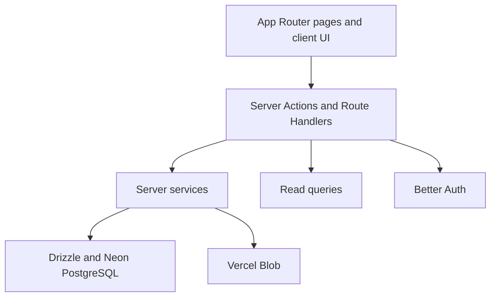

# zihAI

zihAI is a moderated launchpad for independent AI products. Builders sign in with GitHub or Google, create a public profile, submit products with screenshots, and publish an ongoing build log. Projects and iterations become public only after an administrator approves them.

## What is included

- GitHub and Google OAuth account creation with Better Auth
- Required onboarding with a unique username, avatar, and local password
- Project drafts, moderation, rejection feedback, resubmission, and deletion
- One to three ordered screenshots per project and iteration
- Approved-project likes with a database-enforced uniqueness constraint
- Public product pages, builder profiles, metadata, Open Graph, robots, and sitemap
- Admin queues for projects and iterations, user roles, bans, and audit history
- Neon PostgreSQL migrations and Vercel Blob direct uploads
- Responsive public, dashboard, settings, and admin interfaces

## Architecture



The codebase keeps request boundaries, business rules, persistence, and external storage separate:

| Area             | Responsibility                                                                          |
| ---------------- | --------------------------------------------------------------------------------------- |
| `src/app`        | Routes, layouts, metadata, and server-rendered composition                              |
| `src/components` | Reusable server and client UI                                                           |
| `src/actions`    | Authenticated mutation entry points; validation, orchestration, cache refresh, redirect |
| `src/server`     | Business workflows and external integrations such as Blob uploads                       |
| `src/db/queries` | Read models for public, dashboard, and admin screens                                    |
| `src/db/schema`  | Drizzle schema and database types                                                       |
| `src/lib`        | Shared validation, lifecycle rules, auth/session helpers, and pure utilities            |

See [docs/ARCHITECTURE.md](docs/ARCHITECTURE.md) for dependency rules, moderation transitions, the upload protocol, and consistency decisions.

## Technology

- Next.js 16 App Router, React 19, TypeScript, and Tailwind CSS 4
- Better Auth with GitHub/Google OAuth, username login, and admin controls
- Neon PostgreSQL with Drizzle ORM and versioned SQL migrations
- Vercel Blob client uploads with signed, short-lived upload intents
- Vitest, ESLint, Prettier, route type generation, and GitHub Actions

## Prerequisites

- Node.js 22.13 or newer; Node.js 24 is recommended
- pnpm 11.16
- A Neon PostgreSQL database
- A public Vercel Blob store
- GitHub and Google OAuth applications

## Local development

1. Install dependencies.

   ```bash
   pnpm install
   ```

2. Create the local environment file.

   ```bash
   cp .env.example .env.local
   ```

3. Fill in every value in `.env.local`. Generate the auth secret with:

   ```bash
   openssl rand -base64 32
   ```

4. Register these local OAuth callbacks:

   ```text
   http://localhost:3000/api/auth/callback/github
   http://localhost:3000/api/auth/callback/google
   ```

5. Apply the database migration and start the app.

   ```bash
   pnpm db:migrate
   pnpm dev
   ```

Open [http://localhost:3000](http://localhost:3000).

## Environment variables

| Variable                | Purpose                                                    |
| ----------------------- | ---------------------------------------------------------- |
| `DATABASE_URL`          | Neon pooled PostgreSQL connection string                   |
| `BETTER_AUTH_SECRET`    | Private auth signing secret of at least 32 characters      |
| `BETTER_AUTH_URL`       | Canonical auth origin, for example `http://localhost:3000` |
| `GITHUB_CLIENT_ID`      | GitHub OAuth client ID                                     |
| `GITHUB_CLIENT_SECRET`  | GitHub OAuth client secret                                 |
| `GOOGLE_CLIENT_ID`      | Google OAuth client ID                                     |
| `GOOGLE_CLIENT_SECRET`  | Google OAuth client secret                                 |
| `BLOB_READ_WRITE_TOKEN` | Read/write token for a public Vercel Blob store            |
| `NEXT_PUBLIC_SITE_URL`  | Public canonical site URL without a trailing slash         |

Only `NEXT_PUBLIC_SITE_URL` is safe to expose to the browser. Never prefix database, auth, OAuth, or Blob secrets with `NEXT_PUBLIC_`.

## First administrator

The first registered user is deliberately **not** promoted automatically.

1. Sign in with GitHub or Google.
2. Complete onboarding.
3. Run the promotion script against the intended environment:

   ```bash
   pnpm admin:promote admin@example.com
   ```

The script only promotes an existing account. Later role changes happen in `/admin/users`, and the application prevents removal or deletion of the final administrator.

## Product invariants

- New accounts may only be created through GitHub or Google OAuth.
- A project links to exactly one website or one GitHub repository.
- Projects and iterations require one to three JPEG, PNG, or WebP images.
- Edits to approved public content return that content to `pending` review.
- A pending iteration does not unpublish its approved project.
- Public queries return approved content only.
- A user can like an approved project at most once.
- Every authorization decision is repeated on the server.

Image counts are checked in the upload workflow and in PostgreSQL triggers, so concurrent uploads cannot bypass the three-image limit.

## Commands

| Command             | Purpose                                                  |
| ------------------- | -------------------------------------------------------- |
| `pnpm dev`          | Start the local Next.js development server               |
| `pnpm build`        | Create a production build                                |
| `pnpm format`       | Format supported files with Prettier                     |
| `pnpm format:check` | Verify formatting without changing files                 |
| `pnpm lint`         | Run ESLint                                               |
| `pnpm typecheck`    | Generate route types and run TypeScript                  |
| `pnpm test`         | Run the Vitest suite once                                |
| `pnpm check`        | Run formatting, lint, types, tests, and production build |
| `pnpm db:generate`  | Generate a migration from schema changes                 |
| `pnpm db:check`     | Validate migration metadata                              |
| `pnpm db:migrate`   | Apply pending migrations                                 |
| `pnpm db:studio`    | Open Drizzle Studio                                      |

Run `pnpm check` before publishing changes. CI runs the same quality gates on pull requests and pushes to `main`.

## Database changes

Change the Drizzle schema first, generate a new migration, and review the SQL before applying it:

```bash
pnpm db:generate
pnpm db:check
pnpm db:migrate
```

Do not edit a migration that has already reached a shared or production database. The initial migration contains hand-reviewed integrity constraints and concurrency-safe image-count triggers in addition to the generated table definitions.

## Deployment

The production target is Vercel, Neon PostgreSQL, and Vercel Blob. Read [docs/DEPLOYMENT.md](docs/DEPLOYMENT.md) before deploying; it covers environment separation, OAuth callbacks, migration order, first-admin setup, smoke tests, and rollback limits.

## Security

- Proxy redirects are an optimistic navigation guard only. Pages, Server Actions, and upload callbacks validate the session again.
- Resource ownership and administrator role checks happen before every mutation.
- Upload intents are HMAC-signed, expire after ten minutes, and are bound to the user, pathname, content type, and target resource.
- Uploaded MIME type and size are verified from Blob metadata before persistence.
- Markdown rendering does not enable raw HTML.
- Moderation and access-control changes are written to an audit log.

Report security issues privately to the repository owner instead of opening a public issue. See [SECURITY.md](SECURITY.md).
