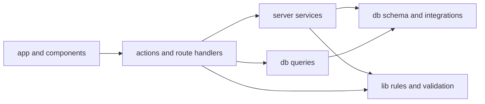
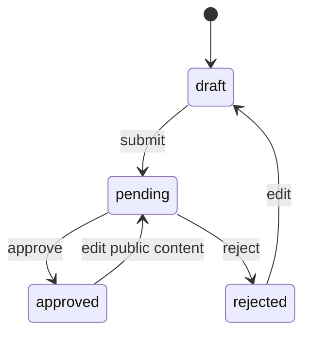

# Architecture

This document describes the boundaries that keep zihAI maintainable as the product grows. It is the source of truth for code placement; `AGENTS.md` turns the same rules into an implementation checklist for coding agents.

## Dependency direction



Dependencies flow inward. Database, authentication, and Blob modules must never be imported into client components.

### `src/app`

Routes compose data and UI. A page may call a read query and a session guard, but it should not contain reusable SQL or business transitions. Route Handlers are transport adapters: parse an HTTP request, call a server service, and translate the result into a response.

### `src/components`

Components render data and collect input. Client components may invoke Server Actions, but they do not decide ownership, roles, moderation status, upload limits, or database constraints.

### `src/actions`

Server Actions are mutation boundaries. Each action should be easy to scan in this order:

1. Validate the session and required role.
2. Parse identifiers and form data.
3. Call a server service or execute one focused transaction.
4. Revalidate every affected consumer.
5. Return an `ActionState` or redirect.

Image actions and administrator actions are split by resource so unrelated workflows do not accumulate in one file.

### `src/server`

Server services hold workflows that cross persistence or integration boundaries:

- `blob.ts` owns Blob credentials, metadata reads, deletion, and upload limits.
- `cache.ts` maps mutations to affected Next.js paths.
- `image-service.ts` owns image ordering and image-driven moderation transitions.
- `upload-policy.ts` issues and verifies upload intents and checks ownership.
- `upload-persistence.ts` validates completed uploads and commits their metadata.
- `upload-completion.ts` makes completion idempotent, compensates failed persistence, and invalidates every affected page.

Server modules begin with `import "server-only"` and must not be imported by client components.

### `src/db`

`schema` defines storage and inferred database types. `queries` contains named, screen-oriented read models. Reusable reads belong here instead of in `page.tsx`; mutations with broader business meaning belong in an Action or server service. Every user-facing collection that can grow without a product limit uses bounded keyset pagination with a timestamp plus stable ID tie-breaker; filters and search terms remain part of the page URL while cursors only describe position. Timestamp cursors preserve PostgreSQL microseconds and compare their boundary in PostgreSQL instead of round-tripping through JavaScript `Date`. This includes public and private project suggestions, notifications, user Ideas, administrative indexes, and moderation history on administrative detail pages.

Deliberately bounded collections do not add pagination: one user can own at most ten projects, one project has at most five images, the public suggestion summary has three items, and the recommendation pool is capped at twenty. Sitemap generation is a full cached export rather than an interactive collection. Any new unbounded list must add a database limit and a continuation cursor in the same change.

Public project discovery is served by `GET /api/projects`. The Route Handler validates the sort, keyword, and page boundary before calling the shared read model. The homepage server-renders page one, then the client requests bounded follow-up pages for infinite scrolling. Keyword matching covers project names and descriptions; the selected latest or hot ordering is applied to the filtered result set.

Public detail routes use an immutable identifier followed by readable text:
`/p/{projectId}/{slug}` for projects and `/u/{userId}/{username}` for builder
profiles. Queries resolve identity from the ID only. A stale slug or username is
permanently redirected to the current canonical path, and the previous
single-segment `/p/{slug}` and `/u/{username}` routes remain as permanent
redirects for existing links.

The database client is created lazily through `getDb()`. Importing a query or
Action module during route discovery does not read runtime credentials; the first
database operation still validates the complete server environment.

`getDb()` uses the neon-http driver: stateless HTTP queries with low latency and
`db.batch()` support, but no interactive transactions — the method is removed
from its public type so misuse fails at compile time. Interactive transactions
use `withTransaction()` from `src/db/index.ts` instead. It drives a
`@neondatabase/serverless` WebSocket pool over the same pooled `DATABASE_URL`,
creates the pool per call, and closes it in `finally` because WebSocket
connections cannot outlive a serverless request. Neon's pooler pins one backend
for the whole `BEGIN..COMMIT` window, so `FOR UPDATE`,
`pg_advisory_xact_lock`, and rollback semantics are preserved. Real-database
integration tests for this contract live in `src/db/integration.test.ts` and run
only with `RUN_DB_IT=1` plus a `DATABASE_TEST_URL` whose database name ends with
`_test`. Tests against a non-Neon PostgreSQL instance may additionally provide
`DATABASE_TEST_WS_PROXY`; this setting is scoped to integration tests and is not
an application runtime fallback.

### `src/lib`

`lib` contains focused shared rules and utilities. In particular, `content-lifecycle.ts` is the single source of truth for what happens when moderated public content changes, while `image-policy.ts` owns the MIME, file-count, and byte limits shared by browser and server upload code. Do not duplicate those rules in Actions, upload callbacks, or components.

## Authentication and authorization

Better Auth owns users, sessions, OAuth accounts, bans, and role-compatible fields.

The Better Auth server instance follows the same request-time boundary through
`getAuth()`, so builds can inspect route modules without initializing OAuth or the
database.

Session reads use Better Auth's signed cookie cache with a five-minute maximum
age to avoid a database roundtrip on ordinary authenticated requests. Onboarding
and profile mutations refresh that cache after updating the current user, while
administrator guards explicitly bypass it so role changes take effect
immediately for privileged operations.

- `requireUser`, `requireOnboardedUser`, and `requireAdmin` guard pages with redirects.
- `assertUser`, `assertOnboardedUser`, and `assertAdmin` guard mutations with errors.
- Proxy checks only improve navigation. They are not an authorization boundary.
- Ownership is part of the database predicate, for example `project.id = ? AND project.owner_id = ?`.
- UI visibility never replaces a server check.

Account creation requires a verified email OTP, GitHub, or Google identity. Direct password sign-up stays disabled. Email OTP accepts every syntactically valid identity email up to 254 characters; the same normalization and validation rule runs before the CAPTCHA request and again in Better Auth's server-side delivery callback. After the first identity check, onboarding adds a username and password, confirms the avatar, and stores a private contact email. Existing OAuth-only users can add a password from security settings. Email OTP uses Resend through `src/server/auth-email.ts`; codes expire after five minutes, allow three attempts, are stored hashed, and sending is scheduled with Next.js `after()` so response timing does not reveal delivery behavior.

Before Better Auth creates or sends a sign-in OTP, its server-side `before` hook requires a five-digit image CAPTCHA. The challenge is rendered as raster PNG data, bound to the normalized identity email with an HMAC, stored in the existing `verification` table for five minutes, and atomically consumed on the first verification attempt. Missing, expired, incorrect, reused, or email-mismatched challenges are rejected before OTP state is created. The browser check is only presentation; the Better Auth hook is the enforcement boundary.

Username/password sign-in is available only after a credential account has been linked to an already authenticated user. Password changes require the current password and revoke other sessions. Verified identity email remains separate from the private operational contact email. Google and verified-email identities provide the default contact email; GitHub email is used when available, otherwise onboarding requires the user to provide one.

## Per-user project capacity

Each user can own at most ten projects across all statuses, including drafts, rejected projects, and archived projects. Deleting a project frees one slot. `createProjectAction` acquires a transaction-scoped PostgreSQL advisory lock derived from the owner ID, counts the owner's rows, and inserts the new project in the same transaction. This serializes concurrent creation attempts so two requests cannot both pass the limit check.

Avatar rendering always has a local default. GitHub and Google profile images are ignored during OAuth registration, and new accounts start with the site default instead. A later custom upload replaces the database reference through the normal Blob workflow.

GitHub accounts without a provider email receive a reserved `.invalid` internal identity address so OAuth account linking remains stable. That placeholder is never treated as a contact address or shown publicly. Contact email input is validated in the onboarding and profile Server Actions and is visible only in account settings and administrator workflows.

## Moderation lifecycle

### ideas

Signed-in, onboarded users can submit private product ideas from the global header and track them under `/dashboard/ideas`. These ideas are separate from general feedback because they carry an explicit delivery lifecycle:

```text
pending -> accepted -> completed
       \-> rejected
```

Administrators process ideas under `/admin/ideas`. Rejecting a pending idea requires a user-visible reason. Completing an accepted idea requires a valid website URL, GitHub repository URL, or both. Each transition locks the idea row and writes its moderation log in the same database transaction. The database check constraint keeps rejection details and completion destinations aligned with the stored status. Submitted ideas are private to their owner and administrators and are never included in public project queries.

### Projects



An approved-project edit clears the previous approval and publication timestamps, hides the public page, and creates a new pending review. Text changes, URL changes, image uploads, deletions, and reordering all use the same lifecycle function.

Owner edits and submissions lock the content row before reading its status. Submission keeps the image-count check and state transition in the same transaction, serialized with upload callbacks that lock the same row.

The public project detail treats its main project record as required data and
likes, viewer session controls, suggestion summaries, and recommendations as
optional UI data. Required-query failures render a safe in-page retry state;
optional-query failures are logged server-side and replace only that section,
never the project body. Recommendation pools use the public project list cache
tag so transient Neon failures and repeated project visits do not create an
uncached database query for every sidebar render.

### Project suggestions

Project suggestions are the explicit exception to the moderated-public-field
rule. An onboarded user may submit plain text directly to another user's
approved project, and the suggestion, status, and rejection reason are public
immediately. Existing suggestions remain available in the private owner/author
dashboards while a project is not public, but public queries always join an
approved project.

```text
pending -> accepted -> completed
       \-> rejected
```

Only the project owner can process a suggestion. Actions lock the suggestion
row and include ownership and current status in the update predicate. The
database state check keeps response timestamps, responder, rejection reason,
and completion time aligned. After the business transaction commits, the
Action schedules its response notification as best-effort after-response work;
notification failure never rolls back or delays the suggestion transition. An
insert trigger locks and re-checks the project, preventing both self-submission
and suggestions to non-approved projects even when application checks race an
archive operation. Multiple suggestions from the same author are allowed.

The public project page uses a cached three-item summary. Once any suggestion
exists it replaces recommendations with that summary; the complete public list
uses an uncached, status-filtered keyset Route Handler with ten items per page.
Its drawer keeps the page result count and navigation controls visible even
when only one page exists. Private received and submitted lists use ten
items per page and are never placed in shared cache entries.

### Notifications

Notifications are typed events with a minimal JSON snapshot rather than stored
localized sentences. They cover new likes, suggestions and suggestion
responses, plus project approval, rejection, archive, and republication.
Self-notifications are suppressed. Foreign keys use `set null` for deleted
actors/projects/suggestions so historical text remains renderable without a
dead link, while deleting the recipient removes the notification.

After hydration, the Header makes one private, no-store request for the current
user's unread count, so notification availability and query latency do not
block server rendering. It does not poll and no WebSocket or SSE channel
exists. Opening the notification drawer uses one transaction to mark every
unread row belonging to that user and then read the first page. Notifications
committed after that update stay unread until the next page load, matching the
intentionally non-real-time contract. Subsequent cursor pages append
automatically when the drawer reaches the scroll sentinel.

Notification-producing mutations commit the originating business change
first, then register an `after()` callback that attempts the notification
insert. The callback catches and logs persistence failures without exposing
them to the client. This deliberately allows a notification to be lost so that
notification database work never extends the business transaction, holds its
row locks, or delays its response.

## Upload protocol

Browser-to-Blob uploads use three checks rather than trusting client metadata:

1. The browser asks `GET /api/blob/upload` for an intent.
2. The server checks the session, onboarding, target ownership, image count, and requested MIME type.
3. The returned intent is signed, resource-bound, pathname-bound, and short-lived.
4. Vercel Blob calls the POST handler, which verifies the session and signed intent before issuing an upload token.
5. After the Blob upload returns, the browser sends the Blob URL, pathname, and signed intent to the authenticated completion endpoint.
6. The completion service re-checks the signed user/path/resource binding, reads Blob metadata, validates MIME type and size again, and stores the Blob URL and pathname in PostgreSQL before the UI reports success.
7. On Vercel, the Blob completion webhook invokes the same idempotent service as a delivery fallback. Local `next dev` does not require a public webhook URL.

Duplicate browser/webhook completion is safe: avatar writes converge on the same pathname, while project image inserts re-check the stored pathname under the project row lock. If persistence fails, the newly uploaded Blob is deleted as compensation. When an avatar replacement commits successfully, failure to delete the old object is logged but does not delete the new object that PostgreSQL now references.

## Blob and database consistency

PostgreSQL and Vercel Blob cannot share a transaction. The code uses explicit ordering based on the operation:

- New upload: upload first, commit metadata second, delete the new Blob if the commit fails.
- Avatar replacement: commit the new reference, then best-effort cleanup of the old Blob.
- User-authored deletion: collect exact pathnames and request Blob deletion before removing relational records.
- Account deletion: remove relational data under the final-admin lock, then best-effort cleanup of collected pathnames.

Every stored object keeps both `blobUrl` for display and `blobPathname` for deletion. New file-bearing models must do the same.

## Cache invalidation

All mutation-to-path mappings live in `src/server/cache.ts`.

Public read models use two cache layers with different responsibilities:

- React request memoization lets `generateMetadata` and the matching page reuse
  the same project or profile lookup during one render.
- The Next.js server data cache stores published project lists, project details,
  creator profiles, and sitemap entries across requests. Entries carry separate
  list, detail, profile, and sitemap tags so mutations can expire only affected
  public data.

Current-user state is never included in a shared public cache entry. Project
detail content and the session start in parallel; the viewer's like state loads
in its own Suspense boundary after authentication resolves.

Neon HTTP read models that need several independent result sets use
`getDb().batch(...)`. This sends the project, image, moderation, or
related statements in one HTTP transaction request while preserving named query
boundaries and authorization filters. Do not replace these batches with
sequential awaits or independent `Promise.all` queries, because both forms add
database network roundtrips with the HTTP driver.

- Project publication, rejection, edits, images, deletion, and likes affect `/`, `/p/{projectId}/{slug}`, and `/u/{userId}/{username}`.
- Suggestion creation and owner decisions expire the project suggestion tag, the project detail, and `/dashboard/suggestions`; private notification state is never placed in the public cache.
- Avatar or username changes affect the homepage, profile, project pages, and account UI. Contact email changes also invalidate administrator user views.
- Admin mutations refresh the relevant queue and dashboard count.
- Submissions and decisions for an idea refresh the owner dashboard, idea queue, detail page, admin overview, and audit log.

When adding a mutation, list every page that consumes the changed data before choosing a cache helper.

## Database integrity

Application validation provides useful errors; PostgreSQL remains the final authority.

- Projects require a website URL, a GitHub URL, or both.
- Likes use a composite primary key.
- Project image pathnames and positions are unique.
- Triggers serialize image inserts and enforce the five-image limit under concurrency.
- Role changes use a PostgreSQL advisory transaction lock so the final administrator cannot be revoked concurrently.
- State constraints for an idea require a rejection reason for rejected ideas and at least one result destination for completed ideas.
- Suggestion constraints and a project-locking trigger enforce legal lifecycle details, approved-project submission, and the no-self-suggestion rule.
- Notification foreign keys preserve history with nullable targets, and the recipient/read indexes keep unread and reverse-time paging bounded.

Schema changes require a new Drizzle migration. Never use production runtime schema synchronization.

## Error handling

Expected, safe messages use `UserFacingError`. Form Actions convert validation failures to field errors and unexpected failures to a generic message. Route Handlers log unexpected errors and avoid returning database or provider details to the browser.

Do not use substring matching as the primary contract between business logic and UI. Add a typed error or a structured Action result when a new expected failure needs to reach the user.

## Verification strategy

Pure lifecycle and validation rules use Vitest. Migration source tests protect
critical triggers, constraints, indexes, and transaction wiring. Opt-in tests
exercise rollback, row locking, concurrent suggestion decisions, recipient-only
read updates, and foreign-key behavior against a disposable `_test` database.
`pnpm check` is the required local gate:

```text
format check → ESLint → route/type generation → unit tests → production build
```

Changes involving authentication, Blob callbacks, database migrations, or cache behavior also require a manual smoke test in a configured preview environment.
