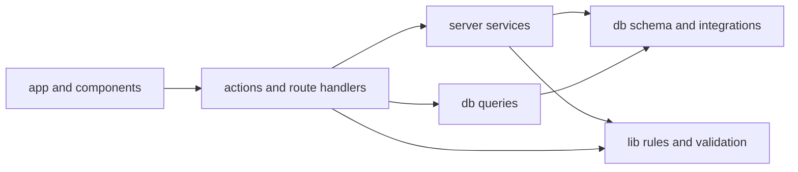
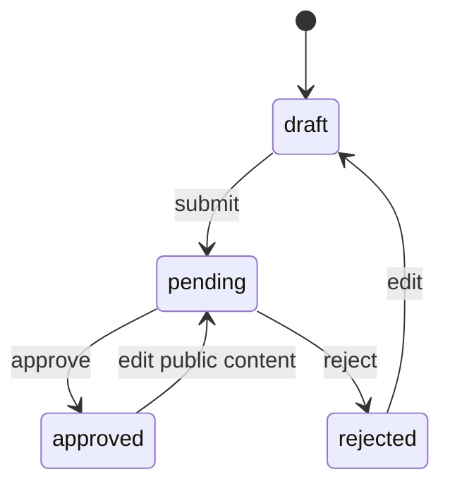

# Architecture

This document describes the boundaries that keep zihAI maintainable as the product grows. It is the source of truth for code placement; `AGENTS.md` turns the same rules into an implementation checklist for coding agents.

## Dependency direction



Dependencies flow inward. Database, authentication, and Blob modules must never be imported into client components.

### `src/app`

Routes compose data and UI. A page may call a read query and a session guard, but it should not contain reusable SQL or business transitions. Route Handlers are transport adapters: parse an HTTP request, call a server service, and translate the result into a response.

### `src/components`

Components render data and collect input. Client components may invoke Server Actions, but they do not decide ownership, roles, moderation status, upload limits, or database constraints.

### `src/actions`

Server Actions are mutation boundaries. Each action should be easy to scan in this order:

1. Validate the session and required role.
2. Parse identifiers and form data.
3. Call a server service or execute one focused transaction.
4. Revalidate every affected consumer.
5. Return an `ActionState` or redirect.

Image actions and administrator actions are split by resource so unrelated workflows do not accumulate in one file.

### `src/server`

Server services hold workflows that cross persistence or integration boundaries:

- `blob.ts` owns Blob credentials, metadata reads, deletion, and upload limits.
- `cache.ts` maps mutations to affected Next.js paths.
- `image-service.ts` owns image ordering and image-driven moderation transitions.
- `upload-policy.ts` issues and verifies upload intents and checks ownership.
- `upload-persistence.ts` validates completed uploads and commits their metadata.

Server modules begin with `import "server-only"` and must not be imported by client components.

### `src/db`

`schema` defines storage and inferred database types. `queries` contains named, screen-oriented read models. Reusable reads belong here instead of in `page.tsx`; mutations with broader business meaning belong in an Action or server service. Large administrative collections use bounded keyset pagination with a timestamp plus stable ID tie-breaker; filters and search terms remain part of the page URL while cursors only describe position.

The database client is created lazily through `getDb()`. Importing a query or
Action module during route discovery does not read runtime credentials; the first
database operation still validates the complete server environment.

### `src/lib`

`lib` contains focused shared rules and utilities. In particular, `content-lifecycle.ts` is the single source of truth for what happens when moderated public content changes, while `image-policy.ts` owns the MIME, file-count, and byte limits shared by browser and server upload code. Do not duplicate those rules in Actions, upload callbacks, or components.

## Authentication and authorization

Better Auth owns users, sessions, OAuth accounts, credentials, bans, and role-compatible fields.

The Better Auth server instance follows the same request-time boundary through
`getAuth()`, so builds can inspect route modules without initializing OAuth or the
database.

- `requireUser`, `requireOnboardedUser`, and `requireAdmin` guard pages with redirects.
- `assertUser`, `assertOnboardedUser`, and `assertAdmin` guard mutations with errors.
- Proxy checks only improve navigation. They are not an authorization boundary.
- Ownership is part of the database predicate, for example `project.id = ? AND project.owner_id = ?`.
- UI visibility never replaces a server check.

Account creation through username/password is disabled. OAuth creates the account; onboarding adds a username and credential password.

## Moderation lifecycle

### Projects



An approved-project edit clears the previous approval and publication timestamps, hides the public page, and creates a new pending review. Text changes, URL changes, image uploads, deletions, and reordering all use the same lifecycle function.

Owner edits and submissions lock the content row before reading its status. Submission keeps the image-count check and state transition in the same transaction, serialized with upload callbacks that lock the same row.

### Iterations

Iterations use the same draft, pending, approved, and rejected states. A pending iteration remains private without changing the parent project's approved status.

## Upload protocol

Browser-to-Blob uploads use three checks rather than trusting client metadata:

1. The browser asks `GET /api/blob/upload` for an intent.
2. The server checks the session, onboarding, target ownership, image count, and requested MIME type.
3. The returned intent is signed, resource-bound, pathname-bound, and short-lived.
4. Vercel Blob calls the POST handler, which verifies the session and signed intent before issuing an upload token.
5. On completion, the server reads Blob metadata, checks MIME type and size again, and stores the Blob URL and pathname in PostgreSQL.

If persistence fails, the newly uploaded Blob is deleted as compensation. When an avatar replacement commits successfully, failure to delete the old object is logged but does not delete the new object that PostgreSQL now references.

## Blob and database consistency

PostgreSQL and Vercel Blob cannot share a transaction. The code uses explicit ordering based on the operation:

- New upload: upload first, commit metadata second, delete the new Blob if the commit fails.
- Avatar replacement: commit the new reference, then best-effort cleanup of the old Blob.
- User-authored deletion: collect exact pathnames and request Blob deletion before removing relational records.
- Account deletion: remove relational data under the final-admin lock, then best-effort cleanup of collected pathnames.

Every stored object keeps both `blobUrl` for display and `blobPathname` for deletion. New file-bearing models must do the same.

## Cache invalidation

All mutation-to-path mappings live in `src/server/cache.ts`.

- Project publication, rejection, edits, images, deletion, and likes affect `/`, `/p/{slug}`, and `/u/{username}`.
- Iteration changes affect the project detail page and its dashboard editor.
- Avatar or username changes affect the homepage, profile, project pages, and account UI.
- Admin mutations refresh the relevant queue and dashboard count.

When adding a mutation, list every page that consumes the changed data before choosing a cache helper.

## Database integrity

Application validation provides useful errors; PostgreSQL remains the final authority.

- Project website and GitHub URL use an XOR check.
- Likes use a composite primary key.
- Project and iteration image pathnames and positions are unique.
- Triggers serialize image inserts and enforce the three-image limit under concurrency.
- An iteration owner must match the parent project owner.
- Role changes use a PostgreSQL advisory transaction lock so the final administrator cannot be revoked concurrently.

Schema changes require a new Drizzle migration. Never use production runtime schema synchronization.

## Error handling

Expected, safe messages use `UserFacingError`. Form Actions convert validation failures to field errors and unexpected failures to a generic message. Route Handlers log unexpected errors and avoid returning database or provider details to the browser.

Do not use substring matching as the primary contract between business logic and UI. Add a typed error or a structured Action result when a new expected failure needs to reach the user.

## Verification strategy

Pure lifecycle and validation rules use Vitest. Database constraints are checked through Drizzle migration validation and should gain integration coverage when a test database is introduced. `pnpm check` is the required local gate:

```text
format check → ESLint → route/type generation → unit tests → production build
```

Changes involving authentication, Blob callbacks, database migrations, or cache behavior also require a manual smoke test in a configured preview environment.
