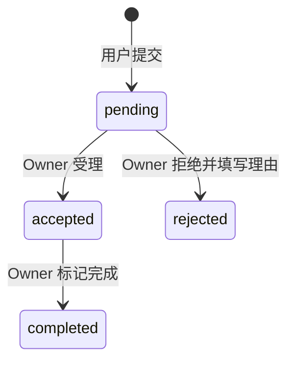

# 项目建议与站内通知系统设计方案

更新日期：2026-08-27

## 1. 文档目标

本文定义 zihAI 的“项目建议”和“站内通知”功能，包括产品规则、页面交互、数据模型、权限边界、事务与并发策略、缓存失效、实施步骤、测试范围和上线顺序。本文同时作为实现与验收依据。

实现状态（2026-08-27）：阶段 A～D 已在 `codex/dev-20260826` 完成，包括增量迁移、建议完整状态闭环、公开列表、个人中心、非阻塞通知事件接线、未读处理、通知无限滚动和自动化测试。阶段 E 的 Preview 迁移、多角色浏览器冒烟与发布记录仍属于部署流程，不能由本地构建结果替代。

项目的“迭代更新”功能已经退出产品范围。项目详情页右侧不再需要兼容迭代更新，后续只在“项目建议”和“推荐项目”之间切换。

## 2. 已确认的产品决定

1. 项目建议不经过管理员审核，提交成功后立即公开。
2. 建议内容、建议状态和拒绝理由对所有访客公开。
3. 用户不能给自己的项目提交建议。
4. 同一用户可以多次给同一个项目提交建议，不设置唯一约束。
5. 只有项目 Owner 可以受理、拒绝和完成该项目的建议。
6. 拒绝建议时必须填写理由；受理后才能标记完成。
7. 用户打开通知列表时，标记该用户当时已有的全部未读通知为已读，而不是只标记当前分页。
8. 通知不使用 WebSocket、SSE 或轮询。未读数量只在登录完成或重新打开页面时读取一次，当前页面内只根据用户操作更新。
9. 通知属于非关键的尽力投递数据。必须先完成原业务，再通过 `after()` 异步尝试写入通知；通知写入失败或丢失不得回滚、延迟或改变原业务结果。

第 1 条是对当前“所有公开用户字段都必须先审核”规则的明确产品例外。项目名称、描述、链接和图片仍执行原审核流程；只有本方案定义的项目建议可以直接公开。正式实施时必须同步更新 `AGENTS.md`、`README.md` 和 `docs/ARCHITECTURE.md`，避免后续实现重新引入审核步骤。

## 3. 范围与非目标

### 3.1 本期范围

- 项目详情页的“提交建议”入口和建议表单。
- 项目建议状态机与 Owner 处理能力。
- 个人中心的“收到的建议”和“我提交的建议”。
- 项目详情页最近 3 条建议和公开建议抽屉。
- 公开建议列表的状态筛选、分页和时间倒序。
- Header 通知图标、未读数量、通知列表和全部已读操作。
- 点赞、建议、建议回应和项目审核状态变更的站内通知。
- 简体中文和英文界面。
- 数据库约束、事务、缓存失效和测试。

### 3.2 本期不做

- 建议的管理员审核或管理员处理后台。
- 建议的私密模式、匿名提交、附件、图片或 Markdown。
- Owner 对建议进行编辑，或提交者在发送后编辑、删除建议。
- 建议评论、多人讨论、@ 提及或邮件通知。
- 通知实时推送、浏览器 Push、短信或邮件提醒。
- 单条通知手动切换已读/未读。
- 通知偏好设置和通知类型开关。
- 自动合并相似建议、点赞建议或建议排序投票。
- 迭代更新相关通知。

## 4. 角色与权限

| 操作                     | 访客     | 未完成引导的用户 | 已完成引导的普通用户 | 项目 Owner           | 管理员                      |
| ------------------------ | -------- | ---------------- | -------------------- | -------------------- | --------------------------- |
| 查看已发布项目的公开建议 | 可以     | 可以             | 可以                 | 可以                 | 可以                        |
| 提交项目建议             | 跳转登录 | 跳转引导         | 可以，自己的项目除外 | 不能给自己的项目提交 | 与普通用户相同              |
| 查看“我提交的建议”       | 不可以   | 不可以           | 仅自己的             | 仅自己的             | 仅自己的                    |
| 查看“收到的建议”         | 不可以   | 不可以           | 仅自己拥有项目的     | 可以                 | 仅自己拥有项目的            |
| 受理、拒绝、完成建议     | 不可以   | 不可以           | 不可以               | 仅自己项目的建议     | 只有同时是项目 Owner 时可以 |
| 查看自己的通知           | 不可以   | 完成引导后       | 可以                 | 可以                 | 可以                        |

管理员身份本身不赋予项目建议处理权。建议处理属于项目所有权，不属于内容审核权限。

所有 Server Action 和 Route Handler 都必须重新验证会话、引导状态、项目公开状态和所有权。按钮隐藏只用于改善界面，不是授权边界。

## 5. 项目建议业务设计

### 5.1 状态机



状态定义：

| 状态        | 中文   | 含义                       | Owner 可执行操作 |
| ----------- | ------ | -------------------------- | ---------------- |
| `pending`   | 待处理 | 已公开，等待 Owner 回应    | 受理、拒绝       |
| `accepted`  | 已受理 | Owner 已决定处理           | 标记完成         |
| `rejected`  | 已拒绝 | Owner 不处理，必须公开理由 | 无               |
| `completed` | 已完成 | Owner 声明建议已经完成     | 无               |

不支持撤销受理、从拒绝恢复、从完成退回或重复处理。若未来确有恢复需求，应新增明确的状态转换和历史记录，不直接覆盖现有状态。

### 5.2 建议内容规则

- 只保存纯文本，React 按文本渲染，保留换行但不解析 Markdown 或 HTML。
- `content` 去除首尾空白后长度为 10～2,000 个字符。
- 拒绝理由去除首尾空白后长度为 3～2,000 个字符。
- 同一提交者可以对同一项目提交多条建议。
- 只能给 `approved` 项目提交新建议。
- 项目归档或重新进入审核后，不再接受新建议；已有建议仍保存在 Owner 和提交者的个人中心中。
- 项目重新发布后，原有建议重新出现在公开详情页，并可继续接收新建议。
- 删除项目时级联删除该项目的建议；删除提交者账号时删除该用户提交的建议。

### 5.3 提交入口

在 `/p/{projectId}/{slug}` 项目标题操作区，与点赞、访问产品和查看代码按钮放在同一组，增加“提交建议”按钮。

- 访客点击后展示登录引导，并带上当前项目地址作为 `next`。
- 未完成引导的用户点击后展示完成账户设置入口。
- 已完成引导的非 Owner 用户看到输入表单。
- 项目 Owner 不显示可提交按钮，或显示禁用状态及“不能给自己的项目提交建议”说明；服务端仍必须拒绝伪造请求。
- 表单成功后关闭对话框、清空输入、显示成功提示，并刷新详情页建议区域。
- 表单失败时保留输入并显示安全错误，不返回数据库内部错误。

建议表单使用 Portal 或原生模态对话框，必须覆盖：

- Escape 关闭。
- 点击背景关闭。
- 打开时锁定页面滚动。
- 初始焦点进入文本框。
- 关闭后焦点返回触发按钮。
- `aria-modal`、标题关联和键盘可操作性。
- 移动端不超出视口，可滚动查看完整表单。

### 5.4 个人中心

新增 `/dashboard/suggestions`，侧边栏名称为“项目建议”。页面包含两个标签：

1. “收到的建议”：当前用户拥有项目收到的建议，默认标签。
2. “我提交的建议”：当前用户提交给其他项目的建议。

建议采用 URL 参数保留视图状态：

```text
/dashboard/suggestions?view=received&status=pending&cursor=...
/dashboard/suggestions?view=submitted&status=accepted&cursor=...
```

规则：

- 默认按 `created_at DESC, id DESC` 排列，状态变化不改变原提交顺序。
- 每页 20 条，使用时间戳加 UUID 的游标分页。
- 两个标签都支持 `all`、`pending`、`accepted`、`rejected`、`completed` 状态筛选。
- 收到的建议显示项目、提交者、内容、状态、提交时间和 Owner 操作。
- 我提交的建议显示项目、Owner、内容、状态、提交时间和公开拒绝理由。
- 通知可以通过 `focus={suggestionId}` 定位到对应建议；若目标已删除，页面显示安全的“建议已不存在”提示。
- 空列表、加载、提交中、成功和失败状态必须明确可见。

### 5.5 项目详情页右侧

项目详情页右侧动态区域按以下规则渲染：

```text
项目存在建议 → 最近 3 条建议 + 查看全部
项目没有建议 → 推荐项目
```

最近 3 条建议展示：

- 提交者头像和用户名。
- 建议内容摘要。
- 当前状态。
- 提交时间。
- 拒绝状态下展示拒绝理由摘要。
- “查看全部（总数）”按钮。

建议始终按创建时间从近到远排序。即使旧建议刚被受理或完成，也不会移动到最上方。

### 5.6 公开建议抽屉

点击“查看全部”后从页面右侧打开抽屉：

- 桌面端使用固定宽度抽屉，移动端接近全屏。
- 默认显示全部状态，每页 10 条。
- 支持 `all`、`pending`、`accepted`、`rejected`、`completed` 筛选。
- 切换筛选时清空旧列表并重置游标。
- 使用上一页/下一页或“加载更多”实现游标分页，不使用不稳定的纯 offset 分页。
- 列表按 `created_at DESC, id DESC` 稳定排序。
- 建议正文、状态和拒绝理由全部公开显示。
- 抽屉支持 Escape、背景关闭、滚动锁定、焦点约束和触发按钮焦点恢复。
- URL 和接口参数必须经过 Zod 校验；无效状态和游标返回 `400`，未发布或不存在的项目返回 `404`。

抽屉数据通过公开 Route Handler 获取：

```text
GET /api/projects/{projectId}/suggestions?status=accepted&cursor=...&limit=10
```

接口返回：

```ts
type PublicSuggestionPage = {
  items: Array<{
    id: string;
    content: string;
    status: ProjectSuggestionStatus;
    rejectionReason: string | null;
    createdAt: string;
    respondedAt: string | null;
    completedAt: string | null;
    author: {
      id: string;
      username: string;
      image: string | null;
    };
  }>;
  previousCursor: string | null;
  nextCursor: string | null;
};
```

该 Route Handler 默认不缓存并返回 `Cache-Control: no-store`，避免抽屉在 Owner 刚处理建议后展示旧状态。详情页最近 3 条可以使用项目级 Cache Tag，并在提交和状态变化后立即失效。

## 6. 通知系统业务设计

### 6.1 通知事件

| 事件类型                       | 接收者     | 触发时机             | 主要载荷                 | 点击目标     |
| ------------------------------ | ---------- | -------------------- | ------------------------ | ------------ |
| `project_liked`                | 项目 Owner | 点赞从不存在变为存在 | 项目名、点赞用户         | 项目工作台   |
| `project_suggestion_received`  | 项目 Owner | 建议创建成功         | 项目名、提交者、建议摘要 | 收到的建议   |
| `project_suggestion_accepted`  | 建议提交者 | Owner 受理成功       | 项目名、Owner            | 我提交的建议 |
| `project_suggestion_rejected`  | 建议提交者 | Owner 拒绝成功       | 项目名、Owner、拒绝理由  | 我提交的建议 |
| `project_suggestion_completed` | 建议提交者 | Owner 标记完成       | 项目名、Owner            | 我提交的建议 |
| `project_approved`             | 项目 Owner | 管理员审核通过       | 项目名                   | 项目工作台   |
| `project_rejected`             | 项目 Owner | 管理员审核拒绝       | 项目名、拒绝理由         | 项目工作台   |
| `project_archived`             | 项目 Owner | 管理员下架项目       | 项目名                   | 项目工作台   |
| `project_republished`          | 项目 Owner | 管理员重新上架       | 项目名                   | 项目工作台   |

补充规则：

- 取消点赞不创建通知。
- 重新点赞属于新的点赞动作，可以再次创建通知。
- 接收者与操作者相同的事件不创建通知，避免自己给自己产生提醒。
- 项目提交审核、Owner 自己修改项目等自发动作不创建通知。
- 原业务必须先独立提交，通知不得进入点赞 SQL、建议事务或项目审核事务，也不得延长业务行锁持有时间。
- 原业务提交后使用 Next.js `after()` 调度一次尽力写入；回调自行捕获并记录错误，不向客户端抛出。通知允许因数据库、运行时终止等原因丢失，不重试、不补偿、不影响原业务结果。
- 通知文案不直接存储拼接后的中英文句子。数据库保存事件类型和受控载荷，渲染层根据当前语言生成文案。

### 6.2 Header 与未读数量

登录且完成引导后，Header 在账户菜单附近显示通知图标：

- 页面 Hydration 后通过私有 `no-store` 接口查询一次未读数量，不阻塞 Header 和页面的服务端渲染。
- 未读数量为 0 时不显示数字。
- 1～99 显示实际数字，超过 99 显示 `99+`。
- 不轮询、不建立实时连接。
- 其他用户触发的新通知不会实时推送到当前页面；下次登录或重新打开页面时读取。
- 点击通知图标后，在当前页面将 Badge 更新为 0；如果标记已读失败，恢复原数字并显示错误提示。

Header 中的未读数量属于当前用户私有数据，禁止进入公开 `unstable_cache` 或共享 Cache Tag。

### 6.3 打开通知和全部已读

打开通知抽屉时调用 `openNotificationsAction`：

1. `assertOnboardedUser()` 获取当前用户，忽略任何客户端传入的用户 ID。
2. 开启数据库事务。
3. 将该用户当时所有 `read_at IS NULL` 的通知更新为同一个 `read_at` 时间。
4. 查询通知第一页并返回序列化后的安全字段。
5. 事务成功后客户端清空 Badge 并展示列表。

如果在第 3 步之后又有新通知提交，新通知保持未读，留到下一次页面加载读取。这符合“不实时”的产品要求。

通知第一页建议为 20 条，后续分页通过已认证的 Route Handler 获取：

```text
GET /api/notifications?cursor=...&limit=20
```

该接口必须 `no-store`，按 `created_at DESC, id DESC` 排序，只读取当前会话用户的数据。抽屉滚动接近底部时通过 `IntersectionObserver` 自动请求 `nextCursor`，把新页去重后追加到现有列表；不显示上一页/下一页按钮。请求中、全部加载、失败重试状态必须明确可见，同一个游标不得并发请求。

### 6.4 通知展示

- 显示通知类型图标、当前语言文案和事件时间。
- 建议拒绝通知可显示拒绝理由摘要。
- 项目或建议已经删除时仍可根据通知载荷展示历史文案，但不渲染失效链接。
- 操作者账号已删除时显示“已删除用户”，不暴露邮箱。
- 通知内容只渲染文本，不接受数据库中的 HTML。
- 本期不提供单条删除、清空全部或重新标记未读。

## 7. 数据模型

### 7.1 `project_suggestion_status`

PostgreSQL Enum：

```text
pending, accepted, rejected, completed
```

TypeScript 状态常量放在 `src/lib/project-suggestion-lifecycle.ts`，Schema 从该常量创建 Enum，避免数据库和业务规则各维护一份状态列表。

### 7.2 `project_suggestions`

| 字段               | 类型                 | 约束/用途                                |
| ------------------ | -------------------- | ---------------------------------------- |
| `id`               | UUID                 | 主键，默认随机 UUID                      |
| `project_id`       | UUID                 | 外键到 `projects.id`，项目删除时级联删除 |
| `author_id`        | text                 | 外键到 `user.id`，用户删除时级联删除     |
| `content`          | text                 | 10～2,000 字符的纯文本建议               |
| `status`           | enum                 | 默认 `pending`                           |
| `rejection_reason` | text nullable        | 仅 `rejected` 必填                       |
| `responded_at`     | timestamptz nullable | 首次受理或拒绝时间                       |
| `responded_by`     | text nullable        | Owner 用户 ID，删除时 `set null`         |
| `completed_at`     | timestamptz nullable | 完成时间                                 |
| `completed_by`     | text nullable        | 标记完成人，删除时 `set null`            |
| `created_at`       | timestamptz          | 默认当前时间                             |
| `updated_at`       | timestamptz          | 默认当前时间，状态变化时更新             |

索引：

```text
(project_id, created_at DESC, id DESC)
(project_id, status, created_at DESC, id DESC)
(author_id, created_at DESC, id DESC)
(author_id, status, created_at DESC, id DESC)
```

不创建 `(project_id, author_id)` 唯一索引，因为同一用户允许多次提交。

数据库 Check Constraint：

```text
pending:
  responded_at IS NULL
  rejection_reason IS NULL
  completed_at IS NULL

accepted:
  responded_at IS NOT NULL
  rejection_reason IS NULL
  completed_at IS NULL

rejected:
  responded_at IS NOT NULL
  length(trim(rejection_reason)) >= 3
  completed_at IS NULL

completed:
  responded_at IS NOT NULL
  rejection_reason IS NULL
  completed_at IS NOT NULL
```

新增 `BEFORE INSERT OR UPDATE OF project_id, author_id` 触发器，验证：

- 项目存在且状态为 `approved`。
- `author_id` 不等于项目 `owner_id`。

应用层会先给出友好错误，触发器是绕过应用或并发场景下的最终保护。

### 7.3 `notification_type`

PostgreSQL Enum 使用第 6.1 节的九种通知类型。类型常量放在 `src/lib/notifications.ts`，Schema 与渲染映射共同复用。

### 7.4 `notifications`

| 字段            | 类型                 | 约束/用途                                      |
| --------------- | -------------------- | ---------------------------------------------- |
| `id`            | UUID                 | 主键，默认随机 UUID                            |
| `recipient_id`  | text                 | 外键到 `user.id`，接收者删除时级联删除         |
| `actor_id`      | text nullable        | 触发者，删除时 `set null`                      |
| `type`          | enum                 | 通知类型                                       |
| `project_id`    | UUID nullable        | 项目删除时 `set null`                          |
| `suggestion_id` | UUID nullable        | 建议删除时 `set null`                          |
| `payload`       | jsonb                | 受控快照，如项目名、用户名、建议摘要、拒绝理由 |
| `read_at`       | timestamptz nullable | `NULL` 表示未读                                |
| `created_at`    | timestamptz          | 默认当前时间                                   |

索引：

```text
(recipient_id, created_at DESC, id DESC)
partial (recipient_id, created_at DESC, id DESC) WHERE read_at IS NULL
```

`payload` 只能由服务端的类型化通知创建函数生成，不能接收客户端提供的 JSON。载荷仅保存渲染历史通知所需的最小快照，不保存邮箱、联系邮箱、Token、Cookie 或完整敏感资料。

### 7.5 删除行为

- 删除通知接收者：级联删除其全部通知。
- 删除通知操作者：通知保留，`actor_id` 置空。
- 删除项目或建议：通知保留，关联 ID 置空，通过 `payload` 显示历史文本，不再提供目标链接。
- 删除建议提交者：其建议级联删除；相关通知保留为历史记录但关联建议置空。

## 8. 写入流程与事务

### 8.1 提交建议

`submitProjectSuggestionAction(projectId, state, formData)`：

1. `assertOnboardedUser()`。
2. Zod 校验 UUID 和建议正文。
3. `withTransaction()`。
4. 以 `FOR UPDATE` 锁定项目行，要求项目为 `approved`。
5. 比较项目 Owner 与当前用户，拒绝自我提交。
6. 插入 `project_suggestions`。
7. 提交业务事务。
8. 调用 `scheduleNotification()`，在 `after()` 中尽力插入 `project_suggestion_received`；失败只写服务端日志。
9. 失效公开建议、项目详情和 Owner 建议页。
10. 返回结构化成功状态，不重定向。

项目行锁与管理员下架动作使用相同的项目行，保证“提交建议”和“下架项目”并发时得到确定结果：先下架则提交失败；先提交则建议完整提交，随后项目下架。通知是事务提交后的非关键副作用，不参与该一致性保证。

### 8.2 Owner 处理建议

Actions 放在独立的 `src/actions/project-suggestion.ts`，不要混入项目表单 Action：

- `acceptProjectSuggestionAction(suggestionId)`
- `rejectProjectSuggestionAction(suggestionId, state, formData)`
- `completeProjectSuggestionAction(suggestionId)`

每个 Action：

1. 校验已完成引导的会话和 UUID/表单。
2. 事务内锁定建议行。
3. 通过 `project_suggestions JOIN projects` 验证 `projects.owner_id = session.user.id`。
4. 调用 `assertProjectSuggestionTransition` 验证状态机。
5. 更新时在谓词中再次包含当前状态和项目所有权，不能只依赖先前读取。
6. 提交状态事务。
7. 通过 `scheduleNotification()` 尽力写入给提交者的状态通知。
8. 刷新收到/提交的建议页、项目详情和公开建议 Cache Tag。

两个并发 Owner 请求会串行获取建议行锁。只有第一个合法转换成功，第二个读取新状态后返回安全的预期错误，不产生重复通知。

### 8.3 点赞通知

当前 `toggleLikeAction` 使用单条 CTE 原子切换。通知必须与该 SQL 解耦：

- CTE 只完成点赞切换、结果和计数读取，不访问 `notifications` 表。
- 只有 `added` CTE 实际插入点赞时，Action 才在业务查询完成后调度 `project_liked` 通知。
- `removed` 分支不创建或删除通知。
- 若点赞用户等于项目 Owner，则跳过通知。
- 点赞结果和点赞数读取保持在原数据库批次/事务边界内；通知允许丢失，且失败不得改变点赞响应。

### 8.4 项目审核通知

以下 Action 先在现有事务中提交项目状态和 `moderation_logs`，事务完成后再调度通知：

- `approveProjectAction`
- `rejectProjectAction`
- `archiveProjectAction`
- `republishProjectAction`

通知接收者从锁定的项目行读取，不能由客户端传入。拒绝原因同时进入项目、审核日志和通知受控载荷。通知回调失败不得回滚审核状态，也不得延长审核事务中的项目行锁。

### 8.5 打开通知

`openNotificationsAction()` 使用事务执行“全部未读更新 + 第一页查询”。返回值只包含渲染所需字段，并将 Date 转换为 ISO 字符串。不得返回原始数据库记录、邮箱或内部错误。

## 9. 查询与分页

新增 `src/db/queries/project-suggestions.ts`：

- `getProjectSuggestionSummary(projectId)`：已发布项目最近 3 条和总数。
- `getPublicProjectSuggestions(projectId, filters, options)`：公开抽屉游标分页。
- `getReceivedProjectSuggestions(ownerId, filters, options)`：Owner 收到的建议。
- `getSubmittedProjectSuggestions(authorId, filters, options)`：用户提交的建议。

新增 `src/db/queries/notifications.ts`：

- `getUnreadNotificationCount(recipientId)`。
- `getNotificationPage(recipientId, options)`。

分页继续复用 `src/lib/pagination.ts` 的游标格式，排序键为 `created_at` 和 UUID。游标只描述位置，`status`、`view` 和用户身份来自当前请求；切换筛选时禁止复用旧游标。

公开建议查询必须同时限制 `projects.status = 'approved'`。个人中心查询不要求项目仍公开，但始终限制当前用户是提交者或 Owner。

## 10. 缓存与一致性

新增 Cache Tag：

```text
public-project-suggestions:{projectId}
```

新增 `revalidateProjectSuggestions` helper，集中刷新：

- `/p/{projectId}/{slug}` 及旧 Slug 路径。
- `/dashboard/suggestions`。
- `public-project-suggestions:{projectId}`。

Owner 状态变化还要刷新提交者的 `/dashboard/suggestions`。由于 `revalidatePath('/dashboard/suggestions')` 是路径级刷新，能够覆盖不同用户下一次访问；查询本身不得进入共享用户缓存。

通知列表和未读数都是用户私有数据，不使用公开 Cache Tag，也不使用 `unstable_cache`。打开通知后在当前客户端更新 Badge，无需通过全站路径失效模拟实时通知。

建议创建与状态变化后，详情页最近 3 条必须立即可见，因此现有 `src/server/cache.ts` 继续使用立即过期语义，而不是允许当前操作用户读到旧内容的后台刷新。

## 11. 代码落点

### 11.1 新增文件

```text
src/db/schema/project-suggestions.ts
src/db/schema/notifications.ts
src/db/queries/project-suggestions.ts
src/db/queries/notifications.ts
src/lib/project-suggestion-lifecycle.ts
src/lib/project-suggestion-lifecycle.test.ts
src/lib/notifications.ts
src/actions/project-suggestion.ts
src/actions/notification.ts
src/app/api/projects/[projectId]/suggestions/route.ts
src/app/api/notifications/route.ts
src/app/dashboard/suggestions/page.tsx
src/components/project/project-suggestion-button.tsx
src/components/project/project-suggestion-panel.tsx
src/components/project/project-suggestions-drawer.tsx
src/components/dashboard/project-suggestion-list.tsx
src/components/notifications/notification-button.tsx
src/components/notifications/notification-drawer.tsx
```

### 11.2 修改文件

```text
src/db/schema/index.ts
src/lib/validations.ts
src/lib/pagination.ts（仅在确有通用扩展需要时）
src/lib/i18n.ts
src/actions/like.ts
src/actions/admin-project.ts
src/app/p/[projectId]/[slug]/page.tsx
src/components/site-header.tsx
src/components/dashboard/sidebar.tsx
src/server/cache.ts
AGENTS.md
README.md
docs/ARCHITECTURE.md
```

页面只负责组合数据。可复用 SQL 放入 `src/db/queries`，状态转换放入 `src/lib`，事务业务写入放入对应 Action 或服务，客户端组件不得导入数据库、认证私钥或 `src/server`。

## 12. 数据库迁移方案

1. 在 Schema 中加入两个 Enum、`project_suggestions` 和 `notifications`。
2. 运行 `make db-generate` 生成新的增量迁移，不修改任何已进入共享环境的历史迁移。
3. 人工检查：
   - 外键删除策略。
   - 状态 Check Constraint。
   - 自我提交/项目公开状态触发器。
   - 未读部分索引。
   - 建议分页索引顺序。
4. 运行 `make db-check-development`。
5. 在隔离 Development 数据库应用迁移并运行数据库集成测试。
6. Preview 先执行 `make db-check-preview`，再执行 `make db-migrate-preview`。
7. Preview 冒烟验证通过后，Production 执行 `make db-check-production`，再显式执行 `make db-migrate-production CONFIRM_PRODUCTION=yes`。

这是新增表的向前兼容迁移。应用回滚时可以保留新表，旧版本不会访问它们；不要为了回滚应用而立即删除用户建议或通知数据。

## 13. 测试方案

### 13.1 Vitest

`project-suggestion-lifecycle.test.ts` 使用表驱动覆盖：

- `pending -> accepted` 合法。
- `pending -> rejected` 合法。
- `accepted -> completed` 合法。
- 其他转换全部拒绝。
- 拒绝必须有合法理由。

`validations.test.ts` 增加：

- 建议正文 trim 和长度边界。
- 拒绝理由长度边界。
- 状态筛选和分页参数。
- 无效 UUID、状态、游标和超限 page size。

通知纯规则测试：

- 每种事件映射到正确文案键和目标类型。
- 不向操作者本人发送通知。
- `99+` 数量显示规则。
- 删除目标后不生成无效链接。
- 游标页追加时保持时间顺序，并按 ID 去重。
- 事件 helper 使用 `after()` 且自行捕获写入失败；业务 Action 不等待通知。

### 13.2 数据库集成测试

在 `RUN_DB_IT=1` 和专用 `_test` 数据库中覆盖：

- 项目 Owner 无法给自己提交建议。
- 非 Owner 可以对同一项目多次提交。
- 非 `approved` 项目拒绝新建议。
- 数据库 Check Constraint 拒绝不一致状态字段。
- 非 Owner 无法更新建议状态。
- 两个并发处理请求只有一个状态转换成功。
- 建议、点赞和项目审核的业务写入不依赖通知表写入。
- 点赞新增时调度通知，取消点赞不调度通知。
- 打开通知将当前用户的全部未读记录标记为已读，不影响其他用户。
- 在全部已读事务之后提交的新通知保持未读。
- 删除项目、建议、操作者和接收者时符合外键策略。

### 13.3 Playwright / Preview 冒烟

至少准备项目 Owner、建议提交者、第三位访客和管理员：

- 访客/未完成引导用户点击提交入口时得到正确引导。
- Owner 看不到可用的自我提交表单，直接请求也被服务端拒绝。
- 同一用户连续提交两条建议均成功。
- 第一条建议出现后，详情页右侧从推荐项目切换为建议区域。
- 最近 3 条顺序正确，第 4 条只能在抽屉分页中看到。
- 公开建议抽屉状态筛选、游标翻页、空状态和错误状态正确。
- 拒绝理由对未登录访客公开。
- Owner 的收到列表和提交者的提交列表状态一致。
- 点赞、收到建议、建议回应、项目通过/拒绝/下架/重新上架分别创建正确通知。
- Header 首次读取未读数量，无轮询请求。
- 打开通知后全部未读清零，刷新页面后仍为 0。
- 通知抽屉滚动到底自动追加下一游标页，无重复项，加载完成和失败重试状态正确。
- 桌面、平板和移动端布局无横向溢出。
- 模态框和抽屉的 Escape、焦点恢复、背景、滚动锁定和键盘导航正确。
- 浏览器控制台无错误或 hydration 警告。

### 13.4 质量门禁

```bash
pnpm format
pnpm check
make db-check-development
```

Schema 变更还需要检查新迁移 SQL。不能只凭单元测试或构建结果宣称通知、数据库事务和 Preview 浏览器流程已验证。

## 14. 分阶段实施方案

### 阶段 A：领域规则与数据库

- 新增状态常量、生命周期函数和单元测试。
- 新增建议、通知 Schema、约束、触发器和索引。
- 生成并检查迁移。
- 添加数据库集成测试。

完成标准：数据库可以阻止自我建议、非法状态和并发重复处理；通知表故障不影响这些业务约束和事务结果。

### 阶段 B：建议提交和个人中心

- 新增验证 Schema 和建议 Actions。
- 实现提交建议对话框。
- 实现 `/dashboard/suggestions` 两个标签、筛选、分页和 Owner 操作。
- 接入缓存失效与双语文案。

完成标准：Owner 和提交者都能在个人中心完成完整状态闭环。

### 阶段 C：公开详情页

- 实现最近 3 条建议查询。
- 详情页在建议和推荐项目之间切换。
- 实现公开抽屉 Route Handler、筛选和游标分页。
- 完成公开范围、SEO 无影响和响应式检查。

完成标准：所有访客都能看到建议、状态和拒绝理由，分页稳定且不泄露私有字段。

### 阶段 D：通知系统

- 新增通知创建 helper 和查询。
- 在点赞、建议和项目审核提交后接入 `after()` 尽力通知，不进入业务事务。
- 实现 Header Hydration 后单次未读数量请求、通知抽屉、全部已读和游标无限滚动。
- 验证没有轮询或实时依赖。

完成标准：正常情况下定义事件创建正确通知；通知失败不影响原业务，打开通知后全部未读清零，列表可自动加载后续页。

### 阶段 E：Preview 与发布

- 运行完整本地质量门禁。
- 应用 Preview 迁移并完成多角色冒烟。
- 验证 GitHub CI、Vercel Preview 和 Preview Comments。
- 记录迁移、Commit 和回滚入口后再进入 Production 发布流程。

## 15. 验收标准

- [ ] 已发布项目都有提交建议入口。
- [ ] 访客和未完成引导用户得到正确引导。
- [ ] 用户不能给自己的项目提交建议。
- [ ] 同一用户可以向同一项目提交多条建议。
- [ ] 建议提交后无需管理员审核并立即公开。
- [ ] Owner 可以受理、拒绝并填写理由，受理后可以标记完成。
- [ ] 状态只能按规定状态机流转。
- [ ] Owner 和提交者都能在个人中心看到正确列表和状态。
- [ ] 项目有建议时右侧不显示推荐项目，而显示最近 3 条建议。
- [ ] 公开建议抽屉支持状态筛选和稳定分页，并按创建时间倒序。
- [ ] 拒绝理由对所有访客公开。
- [ ] 点赞、建议、建议回应、项目审核通过/拒绝/下架/重新上架都创建通知。
- [ ] Header 未读数只在登录或页面重新打开时读取，不轮询。
- [ ] 打开通知后，该用户当时全部未读通知都标记为已读。
- [ ] 通知写入在业务提交后通过 `after()` 尽力执行，失败或丢失不改变、回滚或延迟原业务。
- [ ] 通知列表使用稳定游标分页，滚动到底自动追加且不重复。
- [ ] 所有请求边界都有 Zod 校验，所有权在服务端和数据库写入谓词中验证。
- [ ] 用户私有查询未进入共享公开缓存。
- [ ] 中英文、桌面、平板、移动端和键盘操作通过验证。
- [ ] 新迁移经过人工检查并通过数据库检查。
- [ ] `pnpm format` 和 `pnpm check` 在当前工作区通过。

## 16. 风险与后续观察

- 建议无需审核且立即公开，存在垃圾内容或攻击性内容风险。本期按已确认产品决定执行，但上线后应监控举报和滥用情况，再决定是否增加限流、举报或管理员下架能力。
- 允许同一用户多次提交可能被滥用。不能使用单实例内存限流；如需限流，应使用适合 Serverless 多实例的共享存储。
- 通知表会持续增长。本期不自动清理，运行一段时间后根据数据量决定保留周期或归档策略。
- `payload` 便于目标删除后展示历史通知，但必须保持最小化、类型化和无敏感信息。
- 无实时通知意味着当前打开页面的 Badge 可能暂时落后，这是产品明确接受的行为，不应通过高频刷新弥补。
